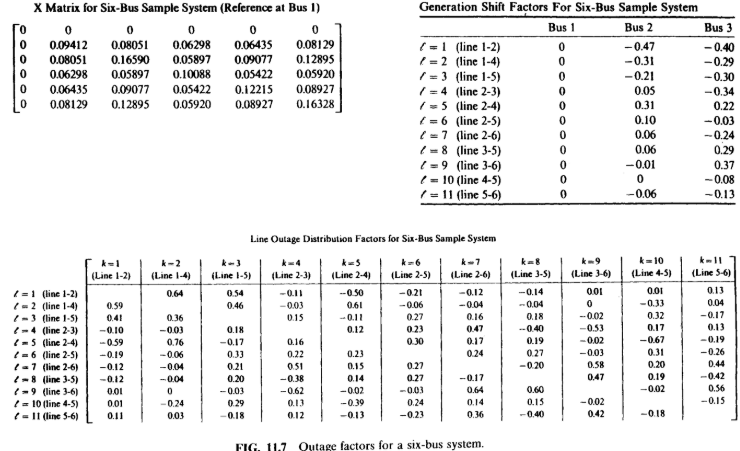
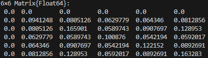
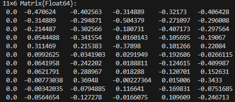
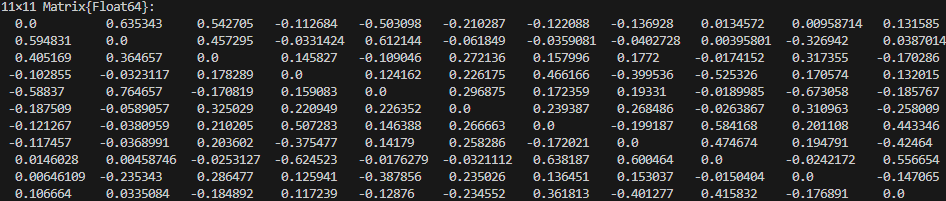

"""
README: Análisis de contingencia en sistemas de potencia

## Introducción
En el siguiente código se presenta un análisis de contingencia el cual se deriva en dos casos:

1. Generation shift factors (GSF).
2. Line outage distribution factors (LODF).


GSF son los cálculos de factores de cambio de generación y LODF son los factores de distribución de pérdida de línea (LODF).

## Teoría

1. **Matriz de Susceptancia (`B`)**
   La matriz de susceptancia representa las propiedades de las líneas de transmisión en una red eléctrica. Se construye a partir de los valores de reactancia (`X`) de las líneas de transmisión.
   

\[
   B_{ij} = \begin{cases}
   \sum \frac{1}{X_{k}} & \text{para } i = j \\
   -\frac{1}{X_{ij}} & \text{para } i \neq j
   \end{cases}
   \]


2. **Matriz `W`**
   La matriz `W` se deriva de la matriz `B` al añadir una fila y columna adicionales para representar la red completa incluyendo el nodo de referencia.

3. **Factores de Cambio de Generación (GSF)**
   Los GSF indican cómo cambiará el flujo de potencia en una línea específica debido a un cambio en la generación en un nodo específico (por ejemplo cuando sale de operación un nodo o se agrega una nueva generación en el caso de las energías renovables).
   

\[
   GSF_{ij} = \frac{W_{ki} - W_{mi}}{X_{ij}}
   \]


   Donde \(W_{ki}\) y \(W_{mi}\) son elementos de la matriz `W`, y \(X_{ij}\) es la reactancia de la línea.

4. **Factores de Distribución de Pérdida de Línea (LODF)**
   Los LODF miden el impacto de la desconexión de una línea sobre el flujo en otras líneas.
   

\[
   LODF_{ij} = \frac{X_{k} (W_{fk} - W_{fm} - W_{tk} + W_{tm})}{X_{ij} (X_{k} - W_{kk} - W_{mm} + 2W_{km})}
   \]


   Donde \(W_{fk}\), \(W_{fm}\), \(W_{tk}\), y \(W_{tm}\) son elementos de la matriz `W`.

## Funciones

1. **Función `Matriz_B(lines, nodes)`**
   - **Entradas:** `lines` (DataFrame de las líneas de transmisión), `nodes` (DataFrame de los nodos).
   - **Procedimiento:** 
     1. Inicializa la matriz `B` como una matriz de ceros de tamaño `n x n`, donde `n` es el número de nodos.
     2. Itera sobre cada línea de transmisión, ajustando la matriz `B` según las propiedades de la línea (`FROM`, `TO` y `X`).
     3. Elimina la primera fila y columna de `B` para obtener la submatriz reducida.
     4. Calcula la inversa de `B`.
   - **Salida:** Matriz de susceptancia `B`.

2. **Función `matriz_W(B)`**
   - **Entradas:** `B` (matriz de susceptancia reducida).
   - **Procedimiento:** 
     1. Inicializa la matriz `W` como una matriz de ceros de tamaño `(n+1) x (n+1)`.
     2. Copia los elementos de `B` en la submatriz de `W`.
   - **Salida:** Matriz `W`.

3. **Función `calculate_GSF(W, lines, nodes)`**
   - **Entradas:** `W` (matriz `W`), `lines` (DataFrame de las líneas de transmisión), `nodes` (DataFrame de los nodos).
   - **Procedimiento:** 
     1. Inicializa la matriz `GSF` como una matriz de ceros de tamaño `(número de líneas) x (número de nodos)`.
     2. Itera sobre cada línea y nodo, calculando el GSF usando los elementos correspondientes de `W`.
   - **Salida:** Matriz de factores de cambio de generación `GSF`.

4. **Función `calculate_LODF(W, lines)`**
   - **Entradas:** `W` (matriz `W`), `lines` (DataFrame de las líneas de transmisión).
   - **Procedimiento:** 
     1. Inicializa la matriz `LODF` como una matriz de ceros de tamaño `(número de líneas) x (número de líneas)`.
     2. Itera sobre cada par de líneas, calculando el LODF usando los elementos correspondientes de `W` y las reactancias de las líneas.
   - **Salida:** Matriz de factores de distribución de pérdida de línea `LODF`.

## Procedimiento General
1. **Carga de datos:** Se cargan los datos de las líneas de transmisión y nodos desde archivos CSV.
   ```julia
   lines = DataFrame(CSV.File("lines.csv"))
   nodes = DataFrame(CSV.File("nodes.csv"))

   Los resultados esperados y obtenidos son los siguientes:







