x 
# Estudio de Conexión Simplificado en el Marco de la Resolución CREG 174 de 2021

El siguiente documento presenta un estudio de Conexión Simplificada el cual se aplica a una red de 907 nodos. El estudio 
consiste en la conexión de un Generador Distribuido (GD) de generación solar en el nodo 885. Se analizan tres casos de 
estudio: potencia máxima, media y mínima en el GD. En este estudio solo se tiene una curva de demanda, la cual se 
considera como demanda máxima. Además, se evalúa el aporte del GD al cortocircuito y finalmente el estudio de pérdidas 
en todo el sistema.

Como primer caso, se analiza el sistema sin generación distribuida (GD) para conocer su estado actual (ver Fig. 1). Se determina que la tensión mínima es de 0.898617 pu en el nodo 885 a las 19 horas, por lo que se decide conectar los GD en este punto.

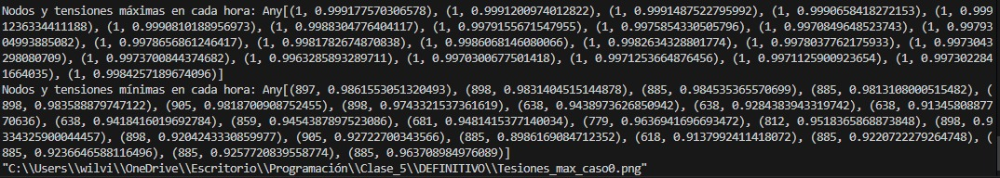
Fig. 1. Tensiones máximas y mínimas en el sistema sin GD.

También se presentan los tres casos de estudio solicitados (ver Fig. 2.): generación máxima, mínima y promedio.
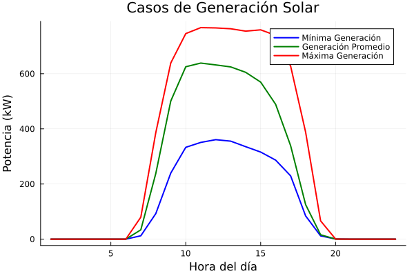
Fig. 2. Casos de estudio.

## Lineamientos para la Realización de los Análisis que Componen el Estudio de Conexión Simplificado

### Definición de Escenarios:

Aunque en el estudio solo se pide el flujo de carga en un punto específo, los resultador que se van a mostrar contiene 
el flujo de carga en todo un día

- Simulación de condiciones más desfavorables en términos de requerimientos de red.
- Escenarios a considerar:

  - **Carga pura**: Demanda máxima con mínima generación.
  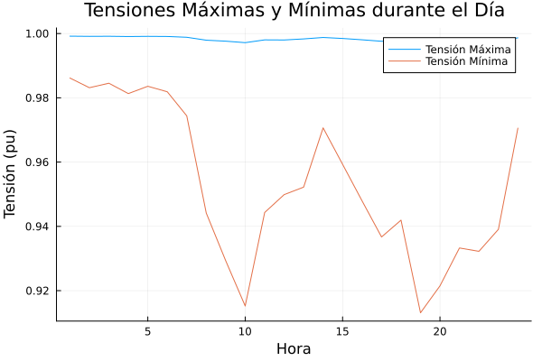
  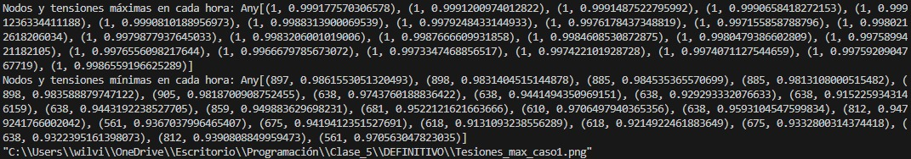
  Fig. 3. Demanda máxima con mínima generación.

  Con la instalación de la generación distribuida (GD), se observa que, con la mínima generación, la tensión mínima se presenta en el nodo 618 con un valor de 0.913109 pu a las 19 horas (ver Fig. 3).

  - **Momento de máxima diferencia**: Máxima generación y mínima demanda.
  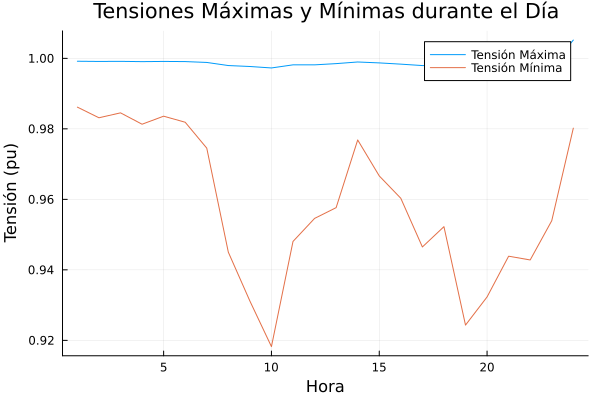
  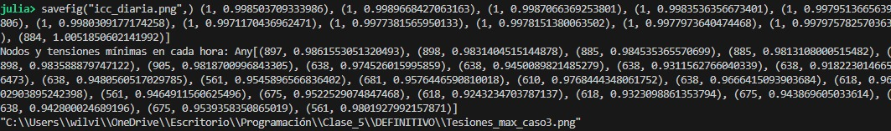
  Fig. 4. Máxima generación y mínima demanda.
  
  En este caso, se observa que con la generación máxima, la tensión mínima se presenta en el nodo 638 con un valor de 0.9182230 pu (ver Fig. 4) a las 10 horas.

  - **Máxima demanda y generación promedio**: Coincidencia en el tiempo de generación promedio y máxima demanda.
    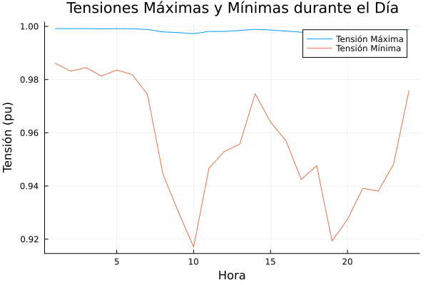
    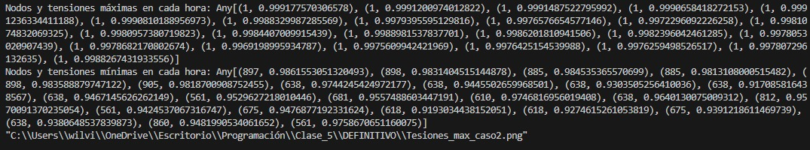
    Fig. 5. generación promedio y máxima demanda.

    En este caso, se observa que con la generación promedio, la tensión mínima se presenta en el nodo 638 con un valor de 0.917085 pu (ver Fig. 4) a las 10 horas.

### Cálculo de Contribución a la Corriente de Cortocircuito:

  Para esta parte, dado que el nodo está tan alejado de la subestación (885), la corriente de cortocircuito (ICC) no es tan elevada como si estuviera cerca de la fuente. Además, con la incorporación de la generación distribuida (GD), el valor de la tensión aumenta, lo cual hace que el valor de la ICC también aumente.

  - Calcular nuevos valores de intensidad de fase máxima ante cortocircuito (caso 1 - mínima generación).
  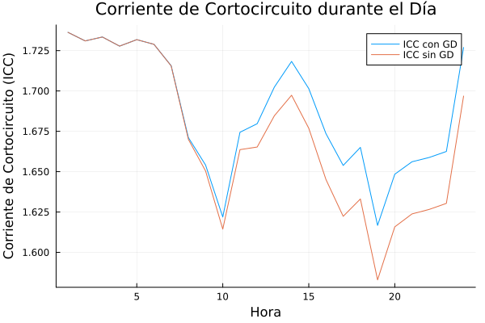
  Fig. 6. Icc con mínima generación.

  - Calcular nuevos valores de intensidad de fase máxima ante cortocircuito (caso 2- mediana generación).
  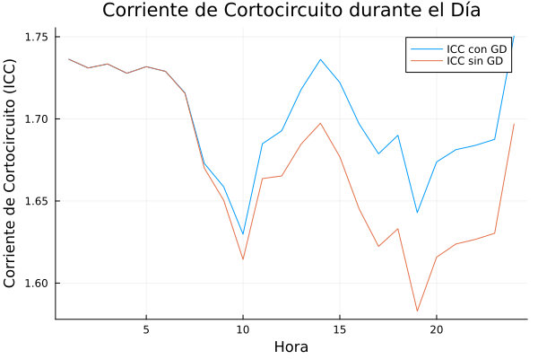
  Fig. 7. Icc con mediana generación.

  - Calcular nuevos valores de intensidad de fase máxima ante cortocircuito (caso 3- máxima generación).
  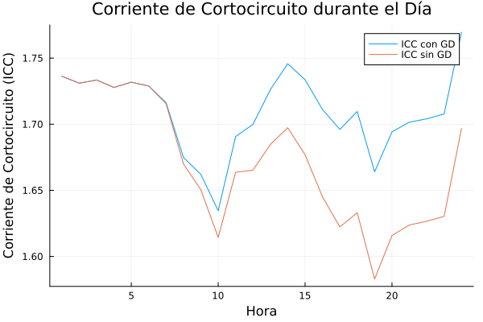
  Fig. 8. Icc con máxima generación.

  Como se observa en las imágenes anteriores, a medida que se incrementa la generación, la ICC aumenta hasta un valor de 1.76955 pu cuando la generación es máxima. Por el contrario, cuando no se tiene generación distribuida (GD), la ICC máxima es de 1.7363248 pu.

### Análisis de Pérdidas

  Las pérdidas se ven acontinuación:

  - Establecer el incremento o disminución del nivel de pérdidas por la conexión del sistema de generación (caso 1 - generación mínima).
  
  Fig. 9. Pérdidas de P con mínima generación.

  - Calcular el nivel de pérdidas con y sin el proyecto (caso 1).

  Sin el proyecto se tienen unas pérdias de 0.032 pu y con este del 0.026 pu.
  Se observa una disminución de las pérdidas en todo el sistema, tomando como referencia las pérdidas máximas en el caso 1, con una disminución alrededor del 18.75%.

  - Establecer el incremento o disminución del nivel de pérdidas por la conexión del sistema de generación (caso 2 - generación media).
  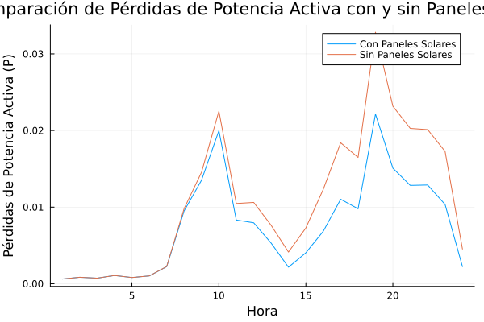
  Fig. 10. Pérdidas de P con mediana generación.

  - Calcular el nivel de pérdidas con y sin el proyecto (caso 2).

  Sin el proyecto se tienen unas pérdias de 0.032 pu y con este del 0.022 pu.
  Se observa una disminución de las pérdidas en todo el sistema, tomando como referencia las pérdidas máximas en el caso 2, con una disminución alrededor del 31.25%.

  - Establecer el incremento o disminución del nivel de pérdidas por la conexión del sistema de generación (caso 3 - generación máxima).
  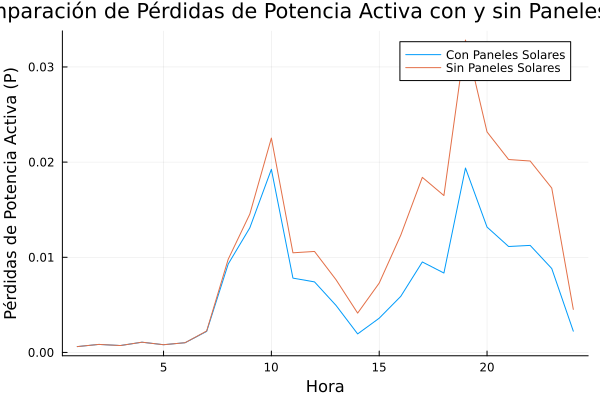
  Fig. 11. Pérdidas de P con máxima generación.

  - Calcular el nivel de pérdidas con y sin el proyecto (caso 3).

  Sin el proyecto se tienen unas pérdias de 0.032 pu y con este del 0.019 pu.
  Se observa una disminución de las pérdidas en todo el sistema, tomando como referencia las pérdidas máximas en el caso 3, con una disminución alrededor del 40.625%.

Se observa que la implementación de la generación distribuida (GD) implica un aumento de la corriente de cortocircuito (ICC). Sin embargo, como punto positivo, se logra ver una disminución de las pérdidas y un aumento de las tensiones en el sistema.
