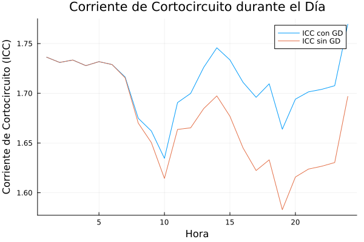

# Informe de Flujo de Carga y Generación Solar

## Cargar los datos del archivo CSV

Los datos se cargaron desde los archivos `lines.csv`, `nodes.csv`, `SolarData.csv` y `Demandas.csv`.

## Calcular la matriz de admitancia Ybus

Se calculó la matriz de admitancia Ybus utilizando los datos de las líneas y nodos.

## Calcular los promedios de ppd y pps

Se calcularon los promedios de potencia por hora para cada día del año utilizando los datos de generación solar y demanda.

## Aplicar K-Means sobre las filas (días), agrupando en 3 clusters

Se aplicó el algoritmo K-Means para agrupar los días en 3 clusters basados en la generación de potencia.

## Calcular el flujo de carga diario con y sin PGEN

Se calcularon los voltajes finales para cada hora del día con y sin generación distribuida (PGEN).

## Calcular las pérdidas de potencia activa

Se calcularon las pérdidas de potencia activa para cada hora del día con y sin generación distribuida (PGEN).

## Calcular la ICC

Se calculó la corriente de cortocircuito (ICC) para cada hora del día con y sin generación distribuida (PGEN).

## Graficar la ICC diaria

Se generó la siguiente gráfica que muestra la corriente de cortocircuito durante el día:

!icc_diaria

## Graficar la comparación de pérdidas de potencia activa

Se generó la siguiente gráfica que muestra la comparación de pérdidas de potencia activa con y sin paneles solares:

!Comparación de pérdidas de potencia activa
